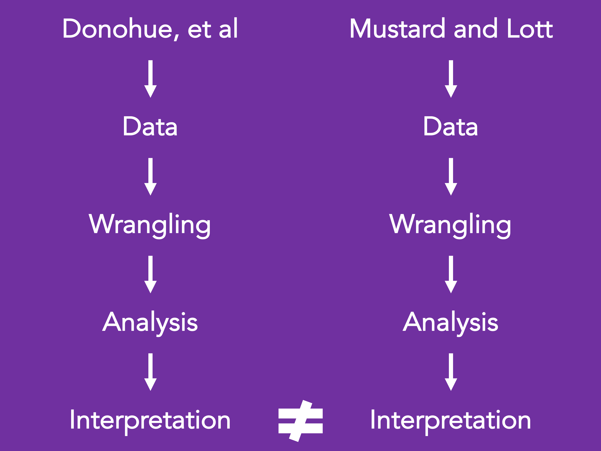

[Motivating paper: Donohue, et al.](https://www.nber.org/papers/w23510.pdf)

[Motivating paper: Lott and Mustard](https://chicagounbound.uchicago.edu/cgi/viewcontent.cgi?article=1150&context=law_and_economics)


Insert Table 2 into this case study

- Question: How does the inclusion of different numbers of age groups influence the results of an analysis of right to carry laws and violence rates?
- Description: We will evaluate how multicollinearity can influence linear regression results and resulted in different conclusions for Donohoe vs Lott on this very important topic. We will also discuss briefly how synthetic control methods can be used to assess the impact of policies by creating controls for comparison that did not have policy adoption but were otherwise similar.

Statistics objectives: Linear regression analysis, discussion about the influence of multicollinearity, and synthetic control methods

# Motivation

## Background

How does the inclusion of different numbers of age groups influence the results of an analysis of right to carry laws and violence rates?



## Analysis goal

We will evaluate how multicollinearity can influence linear regression results and resulted in different conclusions for Donohoe vs Lott on this very important topic. We will also discuss briefly how synthetic control methods can be used to assess the impact of policies by creating controls for comparison that did not have policy adoption but were otherwise similar.

This analysis will demonstrate how details about our methods can be critically influential for our overall conclusions  and can result in important policy related consequences. This report will provide a basis for the motivation:  https://www.nber.org/papers/w23510. As this is a historically controversial topic, we will focus on how different statistical methods can yield different results, but we will avoid making conclusions about right to carry laws.

## Learning objectives

Linear regression analysis, discussion about the influence of multicollinearity, and synthetic control methods

1) wrangling – joining data from multiple sources (dplyr)  and data reshaping (tidyr)
2) visualizations (ggplot2)

## Libraries

```{r}
library(tidyverse)
library(pdftools)
```

# What is the data?

## Data source 1

RTC law data table on page 62 of [this article](https://www.nber.org/papers/w23510)a

## Data source 2

state and regional gun violence data [available here](https://webappa.cdc.gov/sasweb/ncipc/mortrate.html)

## Data source 3

Data on gun use and ownership [available here](Data on gun use and ownership)

## Data source 4

covariate data – population age, sex, race, poverty rates, land area, etc. [available here](https://www.census.gov/data/datasets/time-series/demo/cps/cps-asec.2016.html)

# Data import 

```{r}
syn_control_paper <- pdf_text("w23510.pdf")

syn_control_paper_p_62 <- syn_control_paper[[62]]

test <- syn_control_paper_p_62 %>%
    strsplit("\n") %>%
    unlist() %>%
    as.data.frame() %>%
    slice(-(1:2))

apply(test, 1, nchar)

test[53,] #physcial page 60

test <- test %>%
    slice(-53)

apply(test, 1, str_count, "\\s{5,}")
apply(test, 1, str_count, "\\s{10,}")
apply(test, 1, str_count, "\\s{20,}")
apply(test, 1, str_count, "\\s{40,}")

head(cbind(test, apply(test, 1, str_count, "\\s{40,}")))

test <- test %>%
    apply(1,str_replace_all, "\\s{40,}", "|N/A|") %>%
    str_replace_all("\\s{2,15}", "|") %>%
    as.data.frame()

test <- sapply(test$., str_split, "\\|{1,}")

sapply(test, nchar)

test <- lapply(test, function(x) x[nchar(x) > 0]) 

test <- as.data.frame(do.call(rbind, test))

colnames(test) <- c("State",
                    "E_Date_RTC",
                    "Frac_Yr_Eff_Yr_Pass",
                    "RTC_Date_SA")

test
```

Will need to create a RTC dummy variable

Will need to obtain data shown in appendix 

Will need to produce two analysis dataframes