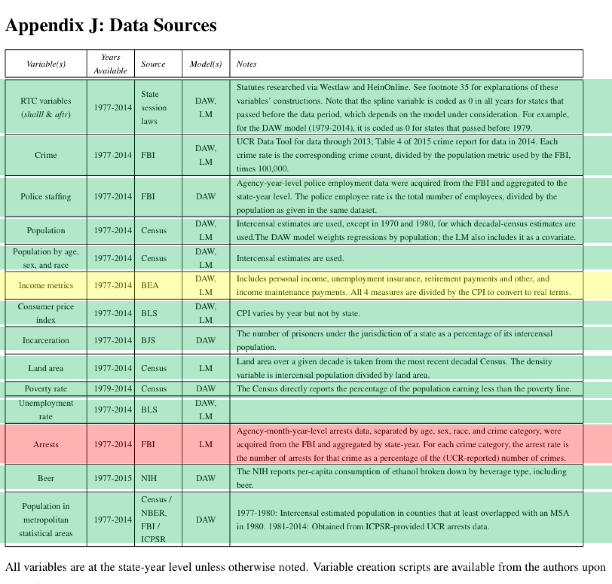

Write sentences about finding the 2000-2010 website finding process

Epi paper on race reference

# RA Notes

## Literature

This case study will focus on conflicting findings from two papers.

[Donohue, et al.](https://www.nber.org/papers/w23510.pdf)

[Lott and Mustard](https://chicagounbound.uchicago.edu/cgi/viewcontent.cgi?article=1150&context=law_and_economics)

## Question

How does the inclusion of different numbers of age groups influence the results of an analysis of right to carry laws and violence rates?

## Description

We will evaluate how multicollinearity can influence linear regression results and resulted in different conclusions for Donohoe vs Lott on this very important topic. We will also discuss briefly how synthetic control methods can be used to assess the impact of policies by creating controls for comparison that did not have policy adoption but were otherwise similar.

## Misc. 

Will need to create a RTC dummy variable

Will need to produce two analysis dataframes

# Motivation

## Background

How does the inclusion of different numbers of age groups influence the results of an analysis of right to carry laws and violence rates?

```{r, echo=FALSE, out.height = '75%', out.width = '75%', fig.align='center'}
knitr::include_graphics('Educational_Graphic1.jpg')
```

## Analysis goal

We will evaluate how multicollinearity can influence linear regression results and resulted in different conclusions for Donohoe vs Lott on this very important topic. We will also discuss briefly how synthetic control methods can be used to assess the impact of policies by creating controls for comparison that did not have policy adoption but were otherwise similar.

This analysis will demonstrate how details about our methods can be critically influential for our overall conclusions  and can result in important policy related consequences. This report will provide a basis for the motivation:  https://www.nber.org/papers/w23510. As this is a historically controversial topic, we will focus on how different statistical methods can yield different results, but we will avoid making conclusions about right to carry laws.

```{r, echo=FALSE, out.height = '75%', out.width = '75%', fig.align='center'}
knitr::include_graphics('Educational_Graphic2.jpg')
```

## Learning objectives

Linear regression analysis, discussion about the influence of multicollinearity, and synthetic control methods

1) wrangling – joining data from multiple sources (dplyr)  and data reshaping (tidyr)
2) visualizations (ggplot2)

## Libraries

```{r}
library(tidyverse)
library(pdftools)
library(readxl)
```

# What is the data?

The datasets below was available to the respective authors at the time of their analyses.

```{r, echo=FALSE, out.height = '100%', out.width = '100%', fig.align='center'}
knitr::include_graphics('Donohue_AppendixJ.png')
```

We were able to obtain the following datasets (or equivalent datasets):

```{r, echo=FALSE, out.height = '100%', out.width = '100%', fig.align='center'}

```

## Data source 1

Right-to-carry law data table on page 62 of [this article](https://www.nber.org/papers/w23510)

## Data source 2

State and regional gun violence data [available here](https://webappa.cdc.gov/sasweb/ncipc/mortrate.html)

## Data source 3

Data on gun use and ownership [available here](Data on gun use and ownership)

## Data source 4

covariate data – population age, sex, race, poverty rates, land area, etc. [available here](https://www.census.gov/data/datasets/time-series/demo/cps/cps-asec.2016.html)

# Data import 

## Table 2, Donohue, et al. 

**This screenshot needs to be taken again. Cursor highlight is showing**

```{r, echo=FALSE, out.height = '100%', out.width = '100%', fig.align='center'}
knitr::include_graphics('Donohue_Table2.png')
```

## RTC laws

Extracted from table in paper **which paper?**

```{r}
syn_control_paper <- pdf_text("w23510.pdf")

syn_control_paper_p_62 <- syn_control_paper[[62]]

test <- syn_control_paper_p_62 %>%
    strsplit("\n") %>%
    unlist() %>%
    as.data.frame() %>%
    slice(-(1:2))

apply(test, 1, nchar)

test[53,] #physcial page 60

test <- test %>%
    slice(-53)

apply(test, 1, str_count, "\\s{5,}")
apply(test, 1, str_count, "\\s{10,}")
apply(test, 1, str_count, "\\s{20,}")
apply(test, 1, str_count, "\\s{40,}")

head(cbind(test, apply(test, 1, str_count, "\\s{40,}")))

test <- test %>%
    apply(1,str_replace_all, "\\s{40,}", "|N/A|") %>%
    str_replace_all("\\s{2,15}", "|") %>%
    as.data.frame()

test <- sapply(test$., str_split, "\\|{1,}")

sapply(test, nchar)

test <- lapply(test, function(x) x[nchar(x) > 0]) 

test <- as.data.frame(do.call(rbind, test))

colnames(test) <- c("State",
                    "E_Date_RTC",
                    "Frac_Yr_Eff_Yr_Pass",
                    "RTC_Date_SA")

test
```

## Crime 

Extracted from [Uniform Crime Reporting Statistics][https://www.ucrdatatool.gov/Search/Crime/State/StatebyState.cfm]

```{r}
read_csv("CrimeStatebyState.csv")
```

## Police Staffing

Extracted from [Crime Data Explorer][https://crime-data-explorer.fr.cloud.gov/downloads-and-docs]

```{r}
read_csv("pe_1960_2018.csv")
```

## Population

1970-1990 estimates extracted from [US Census Bureau](https://www.census.gov/data/tables/time-series/demo/popest/pre-1980-state.html)

1990-2000 estimates extracted from [US Census Bureau](https://www.census.gov/data/datasets/time-series/demo/popest/intercensal-1990-2000-state-and-county-characteristics.html

[Methodology](https://www2.census.gov/programs-surveys/popest/technical-documentation/methodology/intercensal/intercensal-nat-meth.pdf)

[Technical Documentation](https://www2.census.gov/programs-surveys/popest/technical-documentation/file-layouts/1990-2000/stch-intercensal_layout.txt)

2000-2010 estimates extracted from [US Census](https://www.census.gov/data/tables/time-series/demo/popest/intercensal-2000-2010-state.html)

2010-2014 estimates

Extracted from [US Census Bureau](https://data.census.gov/cedsci/)

American Community Survey estimates

## Population by age, sex, and race

Extracted from [US Census Bureau](https://www.census.gov/data/tables/time-series/demo/popest/pre-1980-national.html)

https://www2.census.gov/programs-surveys/popest/tables/1900-1980/state/asrh/

https://www2.census.gov/programs-surveys/popest/tables/1980-1990/counties/asrh/

https://www2.census.gov/programs-surveys/popest/tables/1990-2000/state/asrh/

## Income metrics

### Real Personal income

Extracted from [Bureau of Economic Analysis](https://apps.bea.gov/itable/iTable.cfm?ReqID=70&step=1#)

## Consumer price index 

Extracted from [Bureau of Labor Statistics](https://data.bls.gov/cgi-bin/dsrv?cu)

## Incarceration

https://www.bjs.gov/index.cfm?ty=nps

## Land area

Extracted from [](https://www.census.gov/cgi-bin/geo/shapefiles/index.php)

## Poverty rate

Extracted from Table 21 from [US Census Bureau](https://www.census.gov/data/tables/time-series/demo/income-poverty/historical-poverty-people.html)

## Unemployment rate

Extracted from [Bureau of Labor Statistics](https://data.bls.gov/cgi-bin/dsrv?la)

## Arrests

Data not found for ~period (1995? the earliest)

## Beer consumption

Extracted from [NIH](https://pubs.niaaa.nih.gov/publications/surveillance115/pcyr1970-2018.txt)

## Population in MSAs

Extracted from [US Census Bureau](https://www.census.gov/geographies/reference-files/time-series/demo/metro-micro/historical-delineation-files.html)

```{r}
read_csv("99mfips.txt", skip=17)
```

# Some epi

```{r}
library(ggdag)
set.seed(999)

dagify(VC ~ RTC,
       VC ~ Dem,
       RTC ~ Dem,
       VC ~ Beer,
       RTC ~ Beer,
       Beer ~ Dem,
       VC ~ UE,
       RTC ~ UE,
       VC ~ Poverty,
       RTC ~ Poverty,
       Poverty ~ UE,
       labels = c("VC" = "Violent\nCrime", 
                  "RTC" = "RTC\nLaw",
                  "Beer" = "Beer",
                  "Dem" = "Demographics",
                  "UE" = "Unemployment",
                  "Poverty" = "Poverty"),
       exposure = "RCT",
       outcome = "VC") %>% 
  ggdag(text=FALSE,
        edge_type = "diagonal",
        use_labels = "label",
        node=TRUE,
        text_size = 4,
        label_size = 4,
        stylized = TRUE,
        layout="nicely") +
  theme_void()
```

# Data wrangling

## State FIP codes

Extracted from [US Census Bureau](https://www.census.gov/geographies/reference-files/2014/demo/popest/2014-geocodes-state.html)

```{r}
STATE_FIPS <- read_xls("Data/State_FIPS_codes/state-geocodes-v2014.xls", skip = 5)

head(STATE_FIPS)

colnames(STATE_FIPS) <- c("Region",
                          "Division",
                          "STATEFP",
                          "Name")

class(STATE_FIPS$STATE_FIPS)

STATE_FIPS <- STATE_FIPS %>%
    filter(STATEFP!="00") %>%
    dplyr::select(STATEFP, Name)
```

## Beer 

```{r}
beer_df <- read_table2("Data/Beer/pcyr1970-2018.txt", col_names = FALSE, skip = 131)
colnames(beer_df)

head(beer_df)

columns_beer <- c("Year",
                  "STATEFP",
                  "Beverage",
                  "Gal_bev",
                  "Gal_eth",
                  "Pop_least_14",
                  "Gal_eth_cap_least_14",
                  "Cap_decile_least_14",
                  "Pop_least_21",
                  "Gal_eth_cap_least_21",
                  "Cap_decile_least_21",
                  "Data_source",
                  "TV_ABV",
                  "Gal_eth_TV_ABV")

colnames(beer_df) <- columns_beer

class(beer_df$Beverage)

beer_df <- beer_df %>%
    mutate(STATEFP = str_pad(STATEFP, 2, pad = "0"),
           Beverage = as.character(Beverage)) %>%
    mutate(Beverage = recode_factor(Beverage,
                                    `1`="Spirits",
                                    `2`="Wine",
                                    `3` = "Beer",
                                    `4` = "All beverages")) %>%
    filter(Beverage == "Beer",
           !STATEFP %in% c("91","92","93","94","99")) %>%
    dplyr::select(Year, STATEFP, Gal_eth_cap_least_21) %>%
    rename("Gal_beer_cap"=Gal_eth_cap_least_21) %>%
    mutate(Gal_beer_cap = Gal_beer_cap/10000) %>% # /10000 for correct value (see df)
    left_join(STATE_FIPS, by = "STATEFP")
```

## Demographics

https://www2.census.gov/programs-surveys/popest/tables/1900-1980/state/asrh/

https://www2.census.gov/programs-surveys/popest/tables/1980-1990/counties/asrh/

https://www2.census.gov/programs-surveys/popest/tables/1990-2000/state/asrh/

### 1977-1979

*This needs to be stratified again by sex*

```{r}
dem_77_79 <- read_csv("Data/Demographics/Decade_1970/pe-19.csv", skip = 5)

head(dem_77_79)

colnames(dem_77_79)

class(dem_77_79$`Year of Estimate`)

dem_77_79 <- dem_77_79 %>%
  mutate(Race = case_when(str_detect(`Race/Sex Indicator`,"Black") ~ "Black",
                          str_detect(`Race/Sex Indicator`,"White") ~ "White",
                          TRUE ~ "Other"),
         Sex = case_when(str_detect(`Race/Sex Indicator`,"female") ~ "Female",
                         TRUE ~ "Male")) %>%
  dplyr::select(-`Race/Sex Indicator`)

dem_77_79 <- dem_77_79 %>%
    rename("Year"=`Year of Estimate`,
           "STATEFP"=`FIPS State Code`,
           "Name"=`State Name`) %>%
    filter(Year %in% 1977:1979)
    
dem_77_79 <- dem_77_79 %>%
  pivot_longer(cols=contains("years"),
               names_to = "Age_group",
               values_to = "Population")

#"Year"       "STATEFP"    "Name"       "Race"       "Sex"        "Age_group"  "Population"
```

### 1980-1989

```{r}
dem_80_89 <- list.files(recursive = TRUE,
                  path = "Data/Demographics/Decade_1980/",
                  pattern = "*.csv",
                  full.names = TRUE) %>% 
  map(~read_csv(., skip=5))

dem_80_89 <- dem_80_89 %>%
  map_df(bind_rows)

sapply(dem_80_89, class)

dem_80_89 <- dem_80_89 %>%
  mutate(Race = case_when(str_detect(`Race/Sex Indicator`,"Black") ~ "Black",
                          str_detect(`Race/Sex Indicator`,"White") ~ "White",
                          TRUE ~ "Other"),
         Sex = case_when(str_detect(`Race/Sex Indicator`,"female") ~ "Female",
                         TRUE ~ "Male")) %>%
  dplyr::select(-`Race/Sex Indicator`)

colnames(dem_80_89)

dem_80_89 <- dem_80_89 %>% 
    rename("Year"=`Year of Estimate`,
           "STATEFP"=`FIPS State and County Codes`) %>%
    mutate(STATEFP = substr(STATEFP, start = 1, stop = 2)) %>%
    left_join(STATE_FIPS, by = "STATEFP")

dem_80_89 <- dem_80_89 %>%
  pivot_longer(cols=contains("years"),
               names_to = "Age_group",
               values_to = "Population")

colnames(dem_80_89)

summary(as.factor(dem_80_89$Sex))

# "Year"       "STATEFP"    "Race"       "Name"       "Age_group"  "Population"
```

### 1990-1999

```{r}
dem_90_99 <- list.files(recursive = TRUE,
                  path = "Data/Demographics/Decade_1990/",
                  pattern = "*.txt",
                  full.names = TRUE) %>% 
  map(~read_table2(., skip = 14))

dem_90_99_names <- list.files(recursive = TRUE,
                  path = "Data/Demographics/Decade_1990/",
                  pattern = "*.txt") %>%
    str_extract("[9][0-9]") %>%
    paste0("Year_19",.)

dem_90_99 <- dem_90_99 %>%
  map_df(bind_rows)

colnames(dem_90_99)

head(dem_90_99)

colnames(dem_90_99) <- c("Year",
                         "STATEFP",
                         "Age",
                         "NH_W_M",
                         "NH_W_F",
                         "NH_B_M",
                         "NH_B_F",
                         "NH_AIAN_M",
                         "NH_AIAN_F",
                         "NH_API_M",
                         "NH_API_F",
                         "H_W_M",
                         "H_W_F",
                         "H_B_M",
                         "H_B_F",
                         "H_AIAN_M",
                         "H_AIAN_F",
                         "H_API_M",
                         "H_API_F")

dim(dem_90_99)

dem_90_99 <- dem_90_99 %>%
    mutate(n_na = rowSums(is.na(.)))

dem_90_99 %>%
  group_by(n_na) %>%
  tally()

empty_rows_na <- dem_90_99 %>%
  group_by(n_na) %>%
  tally() %>%
  filter(n_na != 0) %>%
  pull(n_na)

dem_90_99 <- dem_90_99 %>%
  filter(n_na != empty_rows_na) %>%
  dplyr::select(-n_na)

sapply(dem_90_99, class)

dem_90_99 <- dem_90_99 %>%
  mutate(age_group = cut(Age, breaks = seq(0,85, by=5), right = FALSE))
```

### 2000-2010

https://www.census.gov/data/datasets/time-series/demo/popest/intercensal-2000-2010-state.html

https://www2.census.gov/programs-surveys/popest/technical-documentation/file-layouts/2000-2010/intercensal/state/st-est00int-alldata.pdf

```{r}
dem_00_10 <- list.files(recursive = TRUE,
                  path = "Data/Demographics/Decade_2000/",
                  pattern = "*.csv",
                  full.names = TRUE) %>% 
  map(~read_csv(.))

dem_00_10 <- dem_00_10 %>%
  map_df(bind_rows)

sapply(dem_00_10, class)

dem_00_10 <- dem_00_10 %>%
  filter(REGION != 0,
         DIVISION != 0,
         AGEGRP != 0, 
         RACE %in% c(1,2)) %>%
  dplyr::select(-REGION, -DIVISION, -ORIGIN, -CENSUS2010POP)
  
colnames(dem_00_10)

dem_00_10 <- dem_00_10 %>%
  pivot_longer(cols=contains("ESTIMATE"),
               names_to = "Year",
               values_to = "Population")

dem_00_10 <- dem_00_10 %>%
  mutate(Year = str_sub(Year, start=-4))

sapply(dem_00_10, class)
```

## Unemployment

https://data.bls.gov/cgi-bin/dsrv?la

*Needs STATEFP*

```{r}
ue_rate_data <- list.files(recursive = TRUE,
                  path = "Data/Unemployment",
                  pattern = "*.xlsx",
                  full.names = TRUE) %>% 
  map(~read_xlsx(., skip = 10))

ue_rate_names <- list.files(recursive = TRUE,
                  path = "Data/Unemployment",
                  pattern = "*.xlsx",
                  full.names = TRUE) %>%
  map(~read_xlsx(.)) %>%
  sapply(., "[",7,2, drop=TRUE)

names(ue_rate_data) <- ue_rate_names

ue_rate_data$Alabama[dim(ue_rate_data$Alabama)[1],]

ue_rate_data <- ue_rate_data %>%
  map_df(bind_rows, .id = "Name")

colnames(ue_rate_data)

ue_rate_data <- ue_rate_data %>%
  dplyr::select(Name, Year, Annual)
```

## Poverty Rate

Extracted from Table 21 from [US Census Bureau](https://www.census.gov/data/tables/time-series/demo/income-poverty/historical-poverty-people.html)

**persistent warning from unknown origin** https://community.rstudio.com/t/persistent-unknown-or-uninitialised-column-warnings/64879

solution to above is alledgedly: "In any case the suggested approach is to initialize the column"

```{r}
poverty_rate_data <- read_xls("Data/Poverty/hstpov21.xls", skip=2)

head(poverty_rate_data)

colnames(poverty_rate_data) <- c("STATE",
                                 "Total",
                                 "Number",
                                 "Number_se",
                                 "Percent",
                                 "Percent_se")

tail(poverty_rate_data)

notes <- 4

poverty_rate_data <- poverty_rate_data[-((dim(poverty_rate_data)[1]-notes+1):dim(poverty_rate_data)[1]),]

states_eq <- 51

extra_col <- 2

rep_rows <- states_eq + extra_col

groups <- (dim(poverty_rate_data)[1])/(rep_rows)

paste(groups - (2018-1980 + 1), "extra groups.")

poverty_rate_data$year_group <- rep(1:groups, each=rep_rows) 

poverty_rate_data <- poverty_rate_data %>%
  group_by(year_group) %>%
  group_split()

poverty_rate_data_names <- poverty_rate_data %>%
  sapply(., "[",1,1, drop=TRUE) %>%
  str_replace_all(.,"[:space:]","_")

names(poverty_rate_data) <- poverty_rate_data_names

# Recall 2 extra groups. 
# footnotes available at https://www.census.gov/topics/income-poverty/poverty/guidance/poverty-footnotes/cps-historic-footnotes.html

poverty_rate_data$`2017_(21)` <- NULL

poverty_rate_data$`2013_(19)` <- NULL

poverty_rate_data_names <- poverty_rate_data %>%
  sapply(., "[",1,1, drop=TRUE) %>%
  str_sub(., start = 1, end=4)

names(poverty_rate_data) <- poverty_rate_data_names

poverty_rate_data <- poverty_rate_data %>%
  map_df(bind_rows, .id = "Year") %>%
  dplyr::select(-year_group)

poverty_rate_data <- poverty_rate_data %>%
    mutate(n_na = rowSums(is.na(.))) 


# This shows that there is systematic missing values stemmingly *solely* from the rows without poverty data and only a label designating the year
poverty_rate_data %>% 
  group_by(n_na) %>%
  tally()

poverty_rate_data <- poverty_rate_data %>%
  drop_na() %>%
  dplyr::select(-Number,
                -Number_se,
                -Percent_se,
                -n_na)

colnames(poverty_rate_data)
```

## Violent Crime

```{r}
crime_data <- read_lines("Data/Crime/CrimeStatebyState.csv", skip = 2, skip_empty_rows = TRUE)

length(crime_data)

crime_data <- crime_data[-(2143:length(crime_data))]

x <- 2014-1977+1

rep_cycle <- 2 + 2 + x

delete_rows <- c(seq(2,length(crime_data),rep_cycle),
                 seq(2,length(crime_data),rep_cycle))

crime_data <- crime_data[-delete_rows,]
```