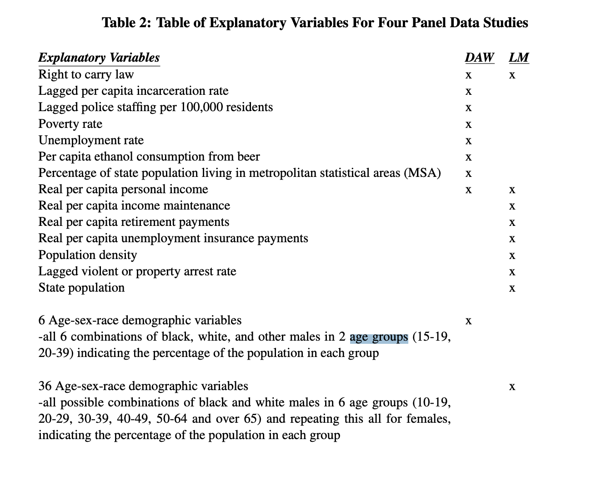
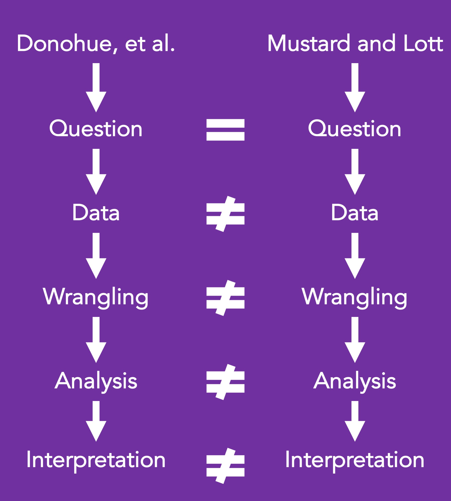
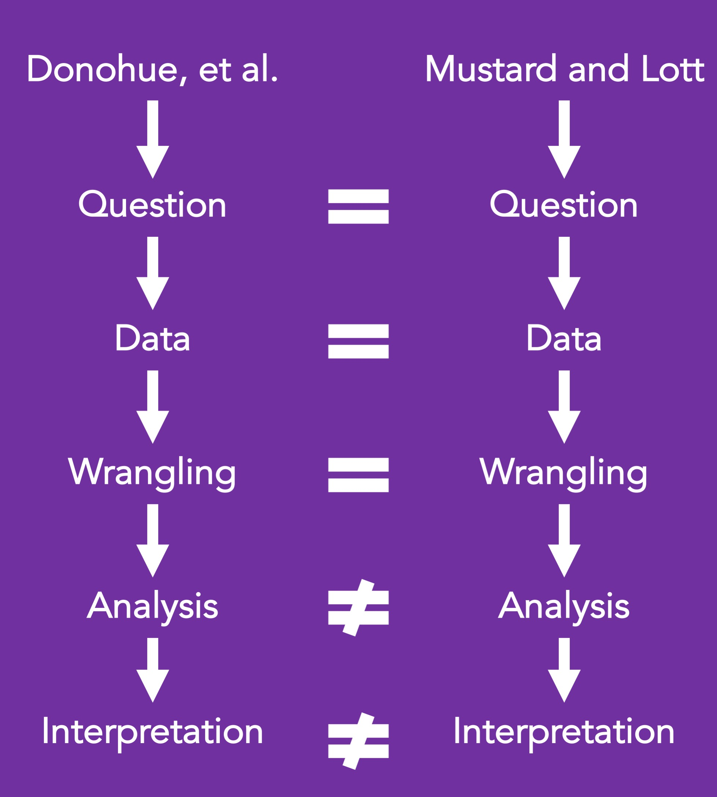

```{r, echo=FALSE}
knitr::opts_chunk$set(fig.width=10, fig.height=7, fig.align='center') 
```

# RA Notes

Need to fix initialization problem 

# Motivation

## Background

This case study will focus on conflicting findings from two papers.

[Donohue, et al.](https://www.nber.org/papers/w23510.pdf)

[Lott and Mustard](https://chicagounbound.uchicago.edu/cgi/viewcontent.cgi?article=1150&context=law_and_economics)

It is important that we do not treat race as an objective measure. Despite this, it can be used to advance scientific inquiry. For more information on this topic, we have included a link to a [paper on the use of race as a measure in epidemiology](https://academic.oup.com/epirev/article/22/2/187/456942). 

How does the inclusion of different numbers of age groups influence the results of an analysis of right to carry laws and violence rates?

## Table 2, Donohue, et al. 

**This screenshot needs to be taken again. Cursor highlight is showing**

```{r, echo=FALSE, out.height = '100%', out.width = '100%', fig.align='center'}

```

```{r, echo=FALSE, out.height = '75%', out.width = '75%', fig.align='center'}

```

## Analysis goal

We will evaluate how multicollinearity can influence linear regression results and result in different conclusions for Donohoe vs Lott on this very important topic. We will also discuss briefly how synthetic control methods can be used to assess the impact of policies by creating controls for comparison that did not have policy adoption but were otherwise similar.

This analysis will demonstrate how details about our methods can be critically influential for our overall conclusions  and can result in important policy related consequences. This report will provide a basis for the motivation:  https://www.nber.org/papers/w23510. As this is a historically controversial topic, we will focus on how different statistical methods can yield different results, but we will avoid making conclusions about right to carry laws.

```{r, echo=FALSE, out.height = '75%', out.width = '75%', fig.align='center'}

```

## Learning objectives

Linear regression analysis, directed acyclic graphs, discussion about the influence of multicollinearity

1) wrangling – joining data from multiple sources (dplyr)  and data reshaping (tidyr)
2) visualizations (ggplot2)

## Libraries

```{r}
library(here) # Thanks, Carrie! 
library(car) # vif function
library(plm) # fixed effect model, linear regression
library(broom) # tidy output
library(tidyverse) # general wrangling functions
library(pdftools) # read data from pdf 
library(readxl) # importing excel sheets
library(cowplot) # to produce plot of plots 
library(GGally)
library(ggrepel)
library(scales)
library(latex2exp)
library(viridis)
library(ggcorrplot)
library(rsample)

set.seed(999)
```

# What is the data?

## Appendix J, Donohue, et al.

Below is table from the [Donohue, et al.](https://www.nber.org/papers/w23510.pdf) paper.

The datasets below were available to the respective authors at the time of their analyses. 

```{r, echo=FALSE, out.height = '100%', out.width = '100%', fig.align='center'}
knitr::include_graphics('Donohue_AppendixJ.png')
```

# Data import 

# Data wrangling

## Variables

### State FIPS codes

The following data was downloaded from the [US Census Bureau](https://www.census.gov/geographies/reference-files/2014/demo/popest/2014-geocodes-state.html)

```{r}
STATE_FIPS <- read_xls("Data/State_FIPS_codes/state-geocodes-v2014.xls", skip = 5)

head(STATE_FIPS)

colnames(STATE_FIPS) <- c("Region",
                          "Division",
                          "STATEFP",
                          "STATE")

class(STATE_FIPS$STATEFP)

STATE_FIPS <- STATE_FIPS %>%
    filter(STATEFP!="00") %>%
    dplyr::select(STATEFP, STATE)
```

### Demographics

#### 1977-1979

The following data was downloaded from the [US Census Bureau](https://www2.census.gov/programs-surveys/popest/tables/1900-1980/state/asrh/).

```{r}
dem_77_79 <- read_csv("Data/Demographics/Decade_1970/pe-19.csv", skip = 5)

head(dem_77_79)

colnames(dem_77_79)

class(dem_77_79$`Year of Estimate`)

dem_77_79 <- dem_77_79 %>%
  mutate(RACE = case_when(str_detect(`Race/Sex Indicator`,"Black") ~ "Black",
                          str_detect(`Race/Sex Indicator`,"White") ~ "White",
                          TRUE ~ "Other"),
         SEX = case_when(str_detect(`Race/Sex Indicator`,"female") ~ "Female",
                         TRUE ~ "Male")) %>%
  dplyr::select(-`Race/Sex Indicator`,-`FIPS State Code`)

dem_77_79 <- dem_77_79 %>%
    rename("YEAR"=`Year of Estimate`,
           "STATE"=`State Name`) %>%
    filter(YEAR %in% 1977:1979)
    
dem_77_79 <- dem_77_79 %>%
  pivot_longer(cols=contains("years"),
               names_to = "AGE_GROUP",
               values_to = "SUB_POP")

colnames(dem_77_79)

pop_77_79 <- dem_77_79 %>%
  group_by(YEAR, STATE) %>%
  summarise("TOT_POP" = sum(SUB_POP), .groups = "drop") 

colnames(pop_77_79)

dem_77_79 <- dem_77_79 %>%
  left_join(pop_77_79, by = c("YEAR","STATE")) %>%
  mutate(PERC_SUB_POP = SUB_POP*100/TOT_POP) %>%
  dplyr::select(-SUB_POP, -TOT_POP)
```

#### 1980-1989

The following data was downloaded from the [US Census Bureau](https://www2.census.gov/programs-surveys/popest/tables/1980-1990/counties/asrh/).

County data was used for this decade. 

```{r}
dem_80_89 <- list.files(recursive = TRUE,
                  path = "Data/Demographics/Decade_1980/",
                  pattern = "*.csv",
                  full.names = TRUE) %>% 
  map(~read_csv(., skip=5))

dem_80_89 <- dem_80_89 %>%
  map_df(bind_rows)

sapply(dem_80_89, class)

dem_80_89 <- dem_80_89 %>%
  mutate(RACE = case_when(str_detect(`Race/Sex Indicator`,"Black") ~ "Black",
                          str_detect(`Race/Sex Indicator`,"White") ~ "White",
                          TRUE ~ "Other"),
         SEX = case_when(str_detect(`Race/Sex Indicator`,"female") ~ "Female",
                         TRUE ~ "Male")) %>%
  dplyr::select(-`Race/Sex Indicator`)

colnames(dem_80_89)

dem_80_89 <- dem_80_89 %>% 
    rename("YEAR"=`Year of Estimate`,
           "STATEFP_temp"=`FIPS State and County Codes`) %>%
    mutate(STATEFP = substr(STATEFP_temp, start = 1, stop = 2)) %>%
    left_join(STATE_FIPS, by = "STATEFP") %>%
  dplyr::select(-STATEFP)

dem_80_89 <- dem_80_89 %>%
  pivot_longer(cols=contains("years"),
               names_to = "AGE_GROUP",
               values_to = "SUB_POP_temp") %>%
  group_by(YEAR, STATE, AGE_GROUP, SEX, RACE) %>%
  summarise(SUB_POP = sum(SUB_POP_temp), .groups="drop")
  
colnames(dem_80_89)

pop_80_89 <- dem_80_89 %>%
  group_by(YEAR, STATE) %>%
  summarise("TOT_POP" = sum(SUB_POP), .groups = "drop") 

colnames(pop_80_89)

dem_80_89 <- dem_80_89 %>%
  left_join(pop_80_89, by = c("YEAR","STATE")) %>%
  mutate(PERC_SUB_POP = SUB_POP*100/TOT_POP) %>%
  dplyr::select(-SUB_POP, -TOT_POP)
```

#### 1990-1999

The following data was downloaded from the [US Census Bureau](https://www2.census.gov/programs-surveys/popest/tables/1990-2000/state/asrh/).

```{r}
dem_90_99 <- list.files(recursive = TRUE,
                  path = "Data/Demographics/Decade_1990/",
                  pattern = "*.txt",
                  full.names = TRUE) %>% 
  map(~read_table2(., skip = 14))

dem_90_99_names <- list.files(recursive = TRUE,
                  path = "Data/Demographics/Decade_1990/",
                  pattern = "*.txt") %>%
    str_extract("[9][0-9]") %>%
    paste0("Year_19",.)

dem_90_99 <- dem_90_99 %>%
  map_df(bind_rows)

colnames(dem_90_99)

head(dem_90_99)

colnames(dem_90_99) <- c("YEAR",
                         "STATEFP",
                         "Age",
                         "NH_W_M",
                         "NH_W_F",
                         "NH_B_M",
                         "NH_B_F",
                         "NH_AIAN_M",
                         "NH_AIAN_F",
                         "NH_API_M",
                         "NH_API_F",
                         "H_W_M",
                         "H_W_F",
                         "H_B_M",
                         "H_B_F",
                         "H_AIAN_M",
                         "H_AIAN_F",
                         "H_API_M",
                         "H_API_F")

dim(dem_90_99)

dem_90_99 <- dem_90_99 %>%
    mutate(W_M = NH_W_M + H_W_M,
           W_F = NH_W_F + H_W_F,
           B_M = NH_B_M + H_B_M,
           B_F = NH_B_F + H_B_F,
           AIAN_M = NH_AIAN_M + H_AIAN_M,
           AIAN_F = NH_AIAN_F + H_AIAN_F,
           API_M = NH_API_M + H_API_M,
           API_F = NH_API_F + H_API_F,
           n_na = rowSums(is.na(.))) %>%
  dplyr::select(-starts_with("NH_"), -starts_with("H_"))

dem_90_99 %>%
  group_by(n_na) %>%
  tally()

empty_rows_na <- dem_90_99 %>%
  group_by(n_na) %>%
  tally() %>%
  filter(n_na != 0) %>%
  pull(n_na)

dem_90_99 <- dem_90_99 %>%
  filter(n_na != empty_rows_na) %>%
  dplyr::select(-n_na)

sapply(dem_90_99, class)

summary(as.factor(dem_80_89$AGE_GROUP))

dem_90_99 <- dem_90_99 %>%
  mutate(AGE_GROUP = cut(Age,
                         breaks = seq(0,90, by=5),
                         right = FALSE,
                         labels = c("Under 5 years",
                                    "5 to 9 years",
                                    "10 to 14 years",
                                    "15 to 19 years",
                                    "20 to 24 years",
                                    "25 to 29 years",
                                    "30 to 34 years",
                                    "35 to 39 years",
                                    "40 to 44 years",
                                    "45 to 49 years",
                                    "50 to 54 years",
                                    "55 to 59 years",
                                    "60 to 64 years",
                                    "65 to 69 years",
                                    "70 to 74 years",
                                    "75 to 79 years",
                                    "80 to 84 years",
                                    "85 years and over")
                         )) %>%
  dplyr::select(-Age) %>%
  mutate(AGE_GROUP = as.character(AGE_GROUP))

sapply(dem_90_99, class)

dem_90_99 <- dem_90_99 %>%
  group_by(YEAR, STATEFP, AGE_GROUP) %>%
  summarise_at(vars(starts_with("W_"),
                    starts_with("B_"),
                    starts_with("AIAN_"),
                    starts_with("API_")), sum) %>%
  ungroup() %>%
  pivot_longer(cols = c(starts_with("W_"),
                    starts_with("B_"),
                    starts_with("AIAN_"),
                    starts_with("API_")),
               names_to = "RACE",
               values_to = "SUB_POP")

dem_90_99 <- dem_90_99 %>%
  mutate(SEX = case_when(str_detect(RACE, "_M") ~ "Male",
                         TRUE ~ "Female"),
         RACE = case_when(str_detect(RACE, "W_") ~ "White",
                          str_detect(RACE, "B_") ~ "Black",
                          TRUE ~ "Other")) %>%
  left_join(STATE_FIPS, by = "STATEFP") %>%
  dplyr::select(-STATEFP)

pop_90_99 <- dem_90_99 %>%
  group_by(YEAR, STATE) %>%
  summarise(TOT_POP = sum(SUB_POP), .groups = "drop")

dem_90_99 <- dem_90_99 %>%
  left_join(pop_90_99, by=c("YEAR", "STATE")) %>%
  mutate(PERC_SUB_POP = SUB_POP*100/TOT_POP) %>%
  dplyr::select(-SUB_POP, -TOT_POP)
```

#### 2000-2010

The following data was downloaded from the [US Census Bureau](https://www.census.gov/data/datasets/time-series/demo/popest/intercensal-2000-2010-state.html).

[Click here for relevant technical documentation](https://www2.census.gov/programs-surveys/popest/technical-documentation/file-layouts/2000-2010/intercensal/state/st-est00int-alldata.pdf)

```{r}
dem_00_10 <- list.files(recursive = TRUE,
                  path = "Data/Demographics/Decade_2000/",
                  pattern = "*.csv",
                  full.names = TRUE) %>% 
  map(~read_csv(.))

dem_00_10 <- dem_00_10 %>%
  map_df(bind_rows)

sapply(dem_00_10, class)

dem_00_10 <- dem_00_10 %>%
  dplyr::select(-ESTIMATESBASE2000,-CENSUS2010POP) %>%
  filter(REGION != 0,
         DIVISION != 0,
         SEX != 0,
         ORIGIN == 0,
         RACE != 0,
         AGEGRP != 0,
         STATE != 0) %>%
  dplyr::select(-REGION, -DIVISION, -ORIGIN, -STATE) %>%
  rename("STATE"=NAME,
         "AGE_GROUP"=AGEGRP) %>%
  mutate(SEX = factor(SEX,
                            levels = 1:2,
                            labels = c("Male",
                                    "Female")),
         RACE = factor(RACE,
                            levels = 1:6,
                            labels = c("White",
                                    "Black",
                                    rep("Other",4))),
         AGE_GROUP = factor(AGE_GROUP,
                            levels = 1:18,
                            labels = c("Under 5 years",
                                    "5 to 9 years",
                                    "10 to 14 years",
                                    "15 to 19 years",
                                    "20 to 24 years",
                                    "25 to 29 years",
                                    "30 to 34 years",
                                    "35 to 39 years",
                                    "40 to 44 years",
                                    "45 to 49 years",
                                    "50 to 54 years",
                                    "55 to 59 years",
                                    "60 to 64 years",
                                    "65 to 69 years",
                                    "70 to 74 years",
                                    "75 to 79 years",
                                    "80 to 84 years",
                                    "85 years and over"))) %>%
  mutate(SEX = as.character(SEX),
         RACE = as.character(RACE),
         AGE_GROUP = as.character(AGE_GROUP))
  
colnames(dem_00_10)

dem_00_10 <- dem_00_10 %>%
  pivot_longer(cols=contains("ESTIMATE"),
               names_to = "YEAR",
               values_to = "SUB_POP")

dem_00_10 <- dem_00_10 %>%
  mutate(YEAR = str_sub(YEAR, start=-4)) %>%
  mutate(YEAR = as.numeric(YEAR))

sapply(dem_00_10, class)

pop_00_10 <- dem_00_10 %>%
  group_by(YEAR, STATE) %>%
  summarise(TOT_POP = sum(SUB_POP), .groups = "drop")

dem_00_10 %>%
  left_join(pop_00_10, by=c("YEAR", "STATE")) %>%
  group_by(YEAR, STATE) %>%
  mutate(PERC_SUB_POP = SUB_POP*100/TOT_POP) %>%
  summarise(perc_tot = sum(PERC_SUB_POP), .groups = "drop") %>%
  mutate(poss_error = case_when(abs(perc_tot - 100) > 0 ~ TRUE, 
                                TRUE ~ FALSE)) %>%
  group_by(poss_error) %>%
  tally()

dem_00_10 <- dem_00_10 %>%
  left_join(pop_00_10, by=c("YEAR", "STATE")) %>%
  mutate(PERC_SUB_POP = SUB_POP*100/TOT_POP) %>%
  dplyr::select(-SUB_POP, -TOT_POP)
```

#### 1977 - 2010

```{r}
setequal(colnames(dem_77_79),colnames(dem_80_89))
setequal(colnames(dem_80_89),colnames(dem_90_99))
setequal(colnames(dem_90_99),colnames(dem_00_10))

head(dem_77_79)
head(dem_80_89)
head(dem_90_99)
head(dem_00_10)

length(summary(as.factor(dem_77_79$AGE_GROUP)))
length(summary(as.factor(dem_80_89$AGE_GROUP)))
length(summary(as.factor(dem_90_99$AGE_GROUP)))
length(summary(as.factor(dem_00_10$AGE_GROUP)))

dem <- bind_rows(dem_77_79,
                 dem_80_89,
                 dem_90_99,
                 dem_00_10)
  
dem %>%
  filter(RACE == "Other") %>%
  group_by(YEAR) %>%
  tally() %>%
  summarise(years_data = n())

2010 - 1977 + 1
  
DONOHUE_AGE_GROUPS <- c("15 to 19 years",
                        "20 to 24 years",
                        "25 to 29 years",
                        "30 to 34 years",
                        "35 to 39 years")

DONOHUE_RACE <- c("White",
                  "Black",
                  "Other")

DONOHUE_SEX <- c("Male")

dem_DONOHUE <- dem %>%
  filter(AGE_GROUP %in% DONOHUE_AGE_GROUPS,
         RACE %in% DONOHUE_RACE,
         SEX %in% DONOHUE_SEX) %>%
  mutate(AGE_GROUP = fct_collapse(AGE_GROUP, "20 to 39 years"=c("20 to 24 years",
                                                                "25 to 29 years",
                                                                "30 to 34 years",
                                                                "35 to 39 years"))) %>%
  mutate(AGE_GROUP = str_replace_all(AGE_GROUP," ","_")) %>%
  group_by(YEAR, STATE, RACE, SEX, AGE_GROUP) %>%
  summarise(PERC_SUB_POP = sum(PERC_SUB_POP), .groups = "drop") %>%
  unite(col = "VARIABLE", RACE, SEX, AGE_GROUP, sep = "_") %>%
  rename("VALUE"=PERC_SUB_POP)

LOTT_AGE_GROUPS_NULL <- c("Under 5 years",
                          "5 to 9 years")

LOTT_RACE <- c("White",
               "Black",
               "Other")

LOTT_SEX <- c("Male",
              "Female")

dem_LOTT <- dem %>%
  filter(!(AGE_GROUP %in% LOTT_AGE_GROUPS_NULL),
         RACE %in% LOTT_RACE,
         SEX %in% LOTT_SEX) %>%
  mutate(AGE_GROUP = fct_collapse(AGE_GROUP,
                                  "10 to 19 years"=c("10 to 14 years",
                                                     "15 to 19 years"),
                                  "20 to 29 years"=c("20 to 24 years",
                                                     "25 to 29 years"),
                                  "30 to 39 years"=c("30 to 34 years",
                                                     "35 to 39 years"),
                                  "40 to 49 years"=c("40 to 44 years",
                                                     "45 to 49 years"),
                                  "50 to 64 years"=c("50 to 54 years",
                                                     "55 to 59 years",
                                                     "60 to 64 years"),
                                  "65 years and over"=c("65 to 69 years",
                                                        "70 to 74 years",
                                                        "75 to 79 years",
                                                        "80 to 84 years",
                                                        "85 years and over"))) %>%
  mutate(AGE_GROUP = str_replace_all(AGE_GROUP," ","_")) %>%
  group_by(YEAR, STATE, RACE, SEX, AGE_GROUP) %>%
  summarise(PERC_SUB_POP = sum(PERC_SUB_POP), .groups = "drop") %>%
  unite(col = "VARIABLE", RACE, SEX, AGE_GROUP, sep = "_") %>%
  rename("VALUE"=PERC_SUB_POP)
  
dim(expand.grid(c(1:6), c(7:8), c(9:10)))[1]
```

```{r}
setequal(colnames(pop_77_79),colnames(pop_80_89))
setequal(colnames(pop_80_89),colnames(pop_90_99))
setequal(colnames(pop_90_99),colnames(pop_00_10))

head(pop_77_79)
head(pop_80_89)
head(pop_90_99)
head(pop_00_10)

population_data <- bind_rows(pop_77_79,
                             pop_80_89,
                             pop_90_99,
                             pop_00_10)

population_data %>%
  group_by(YEAR) %>%
  tally() %>%
  print(n = dim(.)[1])

population_data <- population_data %>%
  mutate(VARIABLE = "Population") %>%
  rename("VALUE"=TOT_POP)
```

### Police staffing

The following data was downloaded from the [Federal Bureau of Investigation](https://crime-data-explorer.fr.cloud.gov/downloads-and-docs).

```{r}
ps_data <- read_csv("Data/Police_staffing/pe_1960_2018.csv",
                    col_types = cols(male_total_ct = "n",
                                     female_total_ct = "n"))

colnames(ps_data)

ps_data <- ps_data %>%
  filter(data_year >= 1977, 
         data_year <= 2014) %>%
  mutate(male_total_ct = case_when(is.na(male_total_ct) ~ 0,
                                   TRUE ~ male_total_ct),
         female_total_ct = case_when(is.na(female_total_ct) ~ 0,
                                   TRUE ~ female_total_ct)) %>%
  mutate(officer_total = male_total_ct + female_total_ct) %>%
  dplyr::select(data_year,
                pub_agency_name,
                state_abbr,
                officer_total)

ps_data <- ps_data %>%
  group_by(data_year, state_abbr) %>%
  summarise(officer_state_total=sum(officer_total), .groups = "drop")

ps_data %>%
  group_by(state_abbr) %>%
  tally() %>%
  print(n = dim(.)[1])

# NB is Nebraska. This was changed to NE to avoid confusions with NB in Canada. This dataset uses NB

state_of_interest_NULL <- c("AS",
                            "GM",
                            "CZ",
                            "FS",
                            "MP",
                            "OT",
                            "PR",
                            "VI")

state_abb_df <- as.data.frame(cbind(state.abb, state.name))

colnames(state_abb_df) <- c("state_abbr", "STATE")

print(state_abb_df)

state_abb_df <- state_abb_df %>%
  add_row(state_abbr="DC",
          STATE="District of Columbia")

denominator_temp <- population_data %>%
  dplyr::select(-VARIABLE) %>%
  rename("Population_temp"=VALUE)

ps_data <- ps_data %>%
  filter(!(state_abbr %in% state_of_interest_NULL)) %>%
  mutate(state_abbr = case_when(state_abbr == "NB" ~ "NE",
                                TRUE ~ state_abbr)) %>%
  left_join(state_abb_df, by = "state_abbr") %>%
  dplyr::select(-state_abbr) %>%
  rename(YEAR = "data_year",
         VALUE = "officer_state_total") %>%
  mutate(VARIABLE = "officer_state_total") %>%
  left_join(denominator_temp, by=c("STATE","YEAR")) %>%
  mutate(VALUE = (VALUE*100000) / Population_temp) %>%
  mutate(VALUE = lag(VALUE)) %>%
  mutate(VARIABLE = "police_per_100k_lag") %>%
  dplyr::select(-Population_temp)
```

### Unemployment

https://data.bls.gov/cgi-bin/dsrv?la

```{r}
ue_rate_data <- list.files(recursive = TRUE,
                  path = "Data/Unemployment",
                  pattern = "*.xlsx",
                  full.names = TRUE) %>% 
  map(~read_xlsx(., skip = 10))

ue_rate_names <- list.files(recursive = TRUE,
                  path = "Data/Unemployment",
                  pattern = "*.xlsx",
                  full.names = TRUE) %>%
  map(~read_xlsx(.)) %>%
  sapply(., "[",7,2, drop=TRUE)

names(ue_rate_data) <- ue_rate_names

ue_rate_data$Alabama[dim(ue_rate_data$Alabama)[1],]

ue_rate_data <- ue_rate_data %>%
  map_df(bind_rows, .id = "STATE")

colnames(ue_rate_data)

sapply(ue_rate_data, class)

ue_rate_data <- ue_rate_data %>%
  mutate(Year = as.numeric(Year)) %>%
  dplyr::select(STATE, Year, Annual) %>%
  rename("YEAR"=Year,
         "VALUE"=Annual) %>%
  mutate(VARIABLE="Unemployment_rate")
```

### Poverty rate

Extracted from Table 21 from [US Census Bureau](https://www.census.gov/data/tables/time-series/demo/income-poverty/historical-poverty-people.html)

**persistent warning from unknown origin** https://community.rstudio.com/t/persistent-unknown-or-uninitialised-column-warnings/64879

solution to above is alledgedly: "In any case the suggested approach is to initialize the column"

```{r}
poverty_rate_data <- read_xls("Data/Poverty/hstpov21.xls", skip=2) #This may cause initialization issue, not easily reproducible (even after restarting R)

head(poverty_rate_data)

colnames(poverty_rate_data) <- c("STATE",
                                 "Total",
                                 "Number",
                                 "Number_se",
                                 "Percent",
                                 "Percent_se")

tail(poverty_rate_data)

notes <- 4

poverty_rate_data <- poverty_rate_data[-((dim(poverty_rate_data)[1]-notes+1):dim(poverty_rate_data)[1]),]

states_eq <- 51

extra_col <- 2

rep_rows <- states_eq + extra_col

groups <- (dim(poverty_rate_data)[1])/(rep_rows)

paste(groups - (2018-1980 + 1), "extra groups")

poverty_rate_data$year_group <- rep(1:groups, each=rep_rows)

poverty_rate_data <- poverty_rate_data %>%
  group_by(year_group) %>%
  group_split()

head(poverty_rate_data[[1]])

poverty_rate_data <- poverty_rate_data %>%
  map(~mutate(.,
              row_id = row_number())) %>%
  map(~filter(.,row_id != 2)) %>%
  map(~dplyr::select(.,-row_id))

poverty_rate_data_names <- poverty_rate_data %>%
  sapply(., "[",1,1, drop=TRUE) %>%
  str_replace_all(.,"[:space:]","_")

names(poverty_rate_data) <- poverty_rate_data_names

# Recall 2 extra groups. 
# footnotes available at https://www.census.gov/topics/income-poverty/poverty/guidance/poverty-footnotes/cps-historic-footnotes.html

poverty_rate_data$`2017_(21)` <- NULL

poverty_rate_data$`2013_(19)` <- NULL

poverty_rate_data_names <- poverty_rate_data %>%
  sapply(., "[",1,1, drop=TRUE) %>%
  str_sub(., start = 1, end=4)

names(poverty_rate_data) <- poverty_rate_data_names

poverty_rate_data <- poverty_rate_data %>%
  map_df(bind_rows, .id = "YEAR") %>%
  dplyr::select(-year_group)

poverty_rate_data <- poverty_rate_data %>%
    mutate(n_na = rowSums(is.na(.))) 

# This shows that there is systematic missing values stemmingly *solely* from the rows without poverty data and only a label designating the year
poverty_rate_data %>% 
  group_by(n_na) %>%
  tally()

sapply(poverty_rate_data, class)

poverty_rate_data <- poverty_rate_data %>%
  drop_na() %>%
  dplyr::select(-Number,
                -Number_se,
                -Percent_se,
                -n_na,
                -Total) %>%
  rename("VALUE"=Percent) %>%
  mutate(VARIABLE = "Poverty_rate",
         YEAR = as.numeric(YEAR),
         VALUE = as.numeric(VALUE))

colnames(poverty_rate_data)
```

### Violent crime

https://www.ucrdatatool.gov/Search/Crime/State/StatebyState.cfm

```{r}
crime_data <- read_lines("Data/Crime/CrimeStatebyState.csv", skip = 2, skip_empty_rows = TRUE)

length(crime_data)

crime_data <- crime_data[-(2143:length(crime_data))]

x <- 2014-1977+1

rep_cycle <- 2 + 2 + x

rep_cycle_cut <- 2 + x

delete_rows <- c(seq(2,length(crime_data),rep_cycle),
                 seq(3,length(crime_data),rep_cycle))

crime_data <- crime_data[-delete_rows]

crime_data <- data.frame(cbind(crime_data, rep(1:(length(crime_data)/rep_cycle_cut),each=rep_cycle_cut)))

colnames(crime_data) <- c("String","STATE_GROUP")

crime_data <- crime_data %>%
  group_by(STATE_GROUP) %>%
  group_split()

columns_crime_data <- 8

crime_data <- crime_data %>%
  map(~mutate(.,
               State = case_when(str_detect(String, "Estimated crime in ") ~ substring(String, nchar("Estimated crime in ")+1)),
              row_id = row_number())) %>%
  map(~fill(., State)) %>%
  map(~filter(.,row_id > 2)) %>%
  map(~mutate(.,
              String = paste0(String, ",", State))) %>%
  map(~dplyr::select(.,String)) %>%
  map(~str_split_fixed(.$String,",",columns_crime_data + 1)) %>%
  map(~data.frame(.)) %>%
  map(~rename(.,"YEAR"=X1,
              "Extra_col1"=X2,
              "VC"=X3,
              "Extra_col2"=X4,
              "Extra_col3"=X5,
              "Extra_col4"=X6,
              "Extra_col5"=X7,
              "Extra_col6"=X8,
              "STATE"=X9)) %>%
  map(~dplyr::select(.,-contains("Extra_col"))) %>%
  map(~.x %>% mutate_all(~trimws(.,which = "both"))) %>%
  map_df(bind_rows)

sapply(crime_data, class)

crime_data <- crime_data %>%
  mutate(VARIABLE = "Viol_crime_count") %>%
  rename("VALUE" = VC) %>%
  as.tibble() %>%
  mutate(YEAR = as.numeric(YEAR),
         VALUE = as.numeric(VALUE))
```

### RTC laws

Extracted from table in [Donohue paper](https://www.nber.org/papers/w23510.pdf)

```{r}
syn_control_paper <- pdf_text("w23510.pdf")

syn_control_paper_p_62 <- syn_control_paper[[62]]

p_62 <- syn_control_paper_p_62 %>%
    strsplit("\n") %>%
    unlist() %>%
    as.data.frame() %>%
    slice(-(1:2))

apply(p_62, 1, nchar)

p_62[53,] #physcial page 60

p_62 <- p_62 %>%
    slice(-53)

apply(p_62, 1, str_count, "\\s{5,}")
apply(p_62, 1, str_count, "\\s{10,}")
apply(p_62, 1, str_count, "\\s{20,}")
apply(p_62, 1, str_count, "\\s{40,}")

head(cbind(p_62, apply(p_62, 1, str_count, "\\s{40,}")))

p_62 <- p_62 %>%
    apply(1,str_replace_all, "\\s{40,}", "|N/A|") %>%
    str_replace_all("\\s{2,15}", "|") %>%
    as.data.frame()

p_62 <- sapply(p_62$., str_split, "\\|{1,}")

sapply(p_62, nchar)

p_62 <- lapply(p_62, function(x) x[nchar(x) > 0]) 

p_62 <- as.data.frame(do.call(rbind, p_62))

rownames(p_62)

rownames(p_62) <- c()

colnames(p_62) <- c("STATE",
                    "E_Date_RTC",
                    "Frac_Yr_Eff_Yr_Pass",
                    "RTC_Date_SA")
sapply(p_62, class)

p_62 <- p_62 %>%
  dplyr::select(STATE, RTC_Date_SA) %>%
  rename("RTC_LAW_YEAR"=RTC_Date_SA) %>%
  mutate(RTC_LAW_YEAR = as.numeric(RTC_LAW_YEAR)) %>%
  mutate(RTC_LAW_YEAR = case_when(RTC_LAW_YEAR == 0 ~ Inf,
                              TRUE ~ RTC_LAW_YEAR))

sapply(p_62, class)

head(p_62)
```

## Checkpoint

```{r}
colnames(dem_DONOHUE)
colnames(dem_LOTT)
colnames(ue_rate_data)
colnames(poverty_rate_data)
colnames(crime_data)

head(dem_DONOHUE)
head(dem_LOTT)
head(ue_rate_data)
head(poverty_rate_data)
head(crime_data)
```

## Join

### Donohue, et al.

```{r}
DONOHUE_DF <- bind_rows(dem_DONOHUE,
                        ue_rate_data,
                        poverty_rate_data,
                        crime_data,
                        population_data,
                        ps_data) %>%
  pivot_wider(names_from = "VARIABLE",
              values_from = "VALUE") %>%
  left_join(p_62 , by = c("STATE")) %>%
  mutate(RTC_LAW = case_when(YEAR >= RTC_LAW_YEAR ~ TRUE,
                              TRUE ~ FALSE))

DONOHUE_DF %>%
  group_by(YEAR) %>%
  tally() %>%
  filter(n != 51) %>%
  print(n=dim(.)[1])

summary(as.factor(DONOHUE_DF$STATE))

max(DONOHUE_DF$YEAR) - min(DONOHUE_DF$YEAR) + 1

DONOHUE_DF <- DONOHUE_DF %>%
  mutate(STATE = fct_collapse(STATE, "District of Columbia"=c("District of Columbia","D.C.")))

summary(as.factor(DONOHUE_DF$STATE))
  
length(levels(DONOHUE_DF$STATE))

DONOHUE_DF <- DONOHUE_DF %>%
  group_by(STATE, YEAR) %>%
  summarise_all(~na.omit(unique(.))) %>%
  ungroup() # This identifies unique observations, coalesces rows according to the grouping variable(s), and gets rid of of units that have incomplete data. This gives returns a dataframe with the most complete information.

summary(as.factor(DONOHUE_DF$STATE)) 

baseline_year <- min(DONOHUE_DF$YEAR)
censoring_year <- max(DONOHUE_DF$YEAR)

# Need to fix this to ensure severe bias is not introduced by prevalent "cases"

DONOHUE_DF <- DONOHUE_DF %>%
  mutate(TIME_0 = baseline_year,
         TIME_INF = censoring_year) %>%
  filter(RTC_LAW_YEAR > TIME_0)

DONOHUE_DF <- DONOHUE_DF %>%
  mutate(Viol_crime_rate_1k = (Viol_crime_count*1000)/Population,
         Viol_crime_rate_1k_log = log(Viol_crime_rate_1k),
         Population_log = log(Population))

summary(droplevels(as.factor(DONOHUE_DF$STATE)))

length(summary(droplevels(as.factor(DONOHUE_DF$STATE))))
```

### Lott and Mustard

```{r}
LOTT_DF <- bind_rows(dem_LOTT,
                     ue_rate_data,
                     poverty_rate_data,
                     crime_data,
                     population_data,
                     ps_data) %>%
  pivot_wider(names_from = "VARIABLE",
              values_from = "VALUE") %>%
  left_join(p_62 , by = c("STATE")) %>%
  mutate(RTC_LAW = case_when(YEAR >= RTC_LAW_YEAR ~ TRUE,
                              TRUE ~ FALSE))

LOTT_DF %>%
  group_by(YEAR) %>%
  tally() %>%
  filter(n != 51) %>%
  print(n=dim(.)[1])

summary(as.factor(LOTT_DF$STATE))

max(LOTT_DF$YEAR) - min(LOTT_DF$YEAR) + 1

LOTT_DF <- LOTT_DF %>%
  mutate(STATE = fct_collapse(STATE, "District of Columbia"=c("District of Columbia","D.C.")))

summary(as.factor(LOTT_DF$STATE))
  
length(levels(LOTT_DF$STATE))

LOTT_DF <- LOTT_DF %>%
  group_by(STATE, YEAR) %>%
  summarise_all(~na.omit(unique(.))) %>%
  ungroup() # This identifies unique observations, coalesces rows according to the grouping variable(s), and gets rid of of units that have incomplete data. This gives returns a dataframe with the most complete information.

summary(as.factor(LOTT_DF$STATE)) 

baseline_year <- min(LOTT_DF$YEAR)
censoring_year <- max(LOTT_DF$YEAR)

# Need to fix this to ensure severe bias is not introduced by prevalent "cases"

LOTT_DF <- LOTT_DF %>%
  mutate(TIME_0 = baseline_year,
         TIME_INF = censoring_year) %>%
  filter(RTC_LAW_YEAR > TIME_0)

LOTT_DF <- LOTT_DF %>%
  mutate(Viol_crime_rate_1k = (Viol_crime_count*1000)/Population,
         Viol_crime_rate_1k_log = log(Viol_crime_rate_1k),
         Population_log = log(Population))

summary(droplevels(as.factor(LOTT_DF$STATE)))

length(summary(droplevels(as.factor(LOTT_DF$STATE))))
```

# Data exploration

```{r}
sapply(DONOHUE_DF, class)

DONOHUE_DF %>%
  mutate(Viol_crime_rate_100k_log = log((Viol_crime_count*100000)/Population)) %>%
  ggplot(aes(x = YEAR, y = Viol_crime_rate_100k_log, color = STATE)) +
  geom_point(size = 0.5) +
  geom_line(aes(group=STATE),
            size = 0.5,
            show.legend = FALSE) +
  geom_text_repel(data = DONOHUE_DF %>%
              mutate(Viol_crime_rate_100k_log = log((Viol_crime_count*100000)/Population)) %>%
              filter(YEAR == last(YEAR)),
            aes(label = STATE,
                x = YEAR,
                y = Viol_crime_rate_100k_log),
            size = 3,
            alpha = 1,
            nudge_x = 10,
            direction = "y",
            hjust = 1,
            vjust = 1,
            segment.size = 0.25,
            segment.alpha = 0.25,
            force = 1,
            max.iter = 9999) +
  guides(color = FALSE) +
  scale_x_continuous(breaks = seq(1980, 2015, by = 1),
                     limits = c(1980, 2015),
                     labels = c(seq(1980, 2010, by = 1), rep("", 5))) +
  scale_y_continuous(breaks = seq(3.5, 8.5, by = 0.5),
                     limits = c(3.5, 8.5)) +
  labs(title = "States have different levels of crime",
       x = "Year",
       y = "ln(violent crimes per 100,000 people)") +
  theme_minimal() +
  theme(axis.text.x = element_text(angle = 90))

DONOHUE_DF %>%
  group_by(YEAR) %>%
  summarise(Viol_crime_count = sum(Viol_crime_count),
            Population = sum(Population),
            .groups = "drop") %>%
  mutate(Viol_crime_rate_100k_log = log((Viol_crime_count*100000)/Population)) %>%
  ggplot(aes(x = YEAR, y = Viol_crime_rate_100k_log)) +
  geom_line() +
  scale_x_continuous(breaks = seq(1980, 2010, by = 1),
                     limits = c(1980, 2010),
                     labels = c(seq(1980, 2010, by = 1))) +
  scale_y_continuous(breaks = seq(5.75, 6.75, by = 0.25),
                     limits = c(5.75, 6.75)) +
  labs(title = "Crime rates fluctuate over time",
       x = "Year",
       y = "ln(violent crimes per 100,000 people)") +
  theme_minimal() + 
  theme(axis.text.x = element_text(angle = 90))
```

# Data analysis

## Donohue, et al.

Some code taken from http://karthur.org/2019/implementing-fixed-effects-panel-models-in-r.html

```{r}
d_panel_DONOHUE <- pdata.frame(DONOHUE_DF, index=c("STATE", "YEAR"))

DONOHUE_OUTPUT <- plm(Viol_crime_rate_1k_log ~
                        RTC_LAW +
                        White_Male_15_to_19_years +
                        White_Male_20_to_39_years +
                        Black_Male_15_to_19_years +
                        Black_Male_20_to_39_years +
                        Other_Male_15_to_19_years +
                        Other_Male_20_to_39_years +
                        Unemployment_rate +
                        Poverty_rate + 
                        Population_log + 
                        police_per_100k_lag,
                      effect = "twoways",
                      model = "within",
                      data=d_panel_DONOHUE)

summary(DONOHUE_OUTPUT)

DONOHUE_OUTPUT_TIDY <- tidy(DONOHUE_OUTPUT, conf.int = 0.95)

DONOHUE_OUTPUT_TIDY$Analysis <- "Analysis 1"
```

## Lott and Mustard

Some code taken from http://karthur.org/2019/implementing-fixed-effects-panel-models-in-r.html

```{r}
LOTT_variables <- LOTT_DF %>%
  dplyr::select(RTC_LAW,
                contains(c("White","Black","Other")),
                Unemployment_rate,
                Poverty_rate,
                Population_log,
                police_per_100k_lag) %>%
  colnames()

LOTT_fmla <- as.formula(paste("Viol_crime_rate_1k_log ~",
                              paste(LOTT_variables, collapse = " + ")
                              )
                        )

d_panel_LOTT <- pdata.frame(LOTT_DF, index=c("STATE", "YEAR"))

LOTT_OUTPUT <- plm(LOTT_fmla,
                      model = "within",
                   effect = "twoways",
                      data=d_panel_LOTT)

summary(LOTT_OUTPUT)

LOTT_OUTPUT_TIDY <- tidy(LOTT_OUTPUT, conf.int = 0.95)

LOTT_OUTPUT_TIDY$Analysis <- "Analysis 2"
```

## Comparing analyses

```{r}
comparing_analyses <- DONOHUE_OUTPUT_TIDY %>%
  bind_rows(LOTT_OUTPUT_TIDY) %>%
  filter(term == "RTC_LAWTRUE")

library(grid)

comparing_analyses_plot <- ggplot(comparing_analyses) + 
  geom_point(aes(x = Analysis, y = estimate)) +
  geom_errorbar(aes(x = Analysis, ymin = conf.low, ymax = conf.high), width = 0.25) + 
  geom_hline(yintercept = 0, color = "red") +
  scale_y_continuous(breaks = seq(-0.2, 0.2, by = 0.05),
                     labels = seq(-0.2, 0.2, by = 0.05),
                     limits = c(-0.2,0.2)) +
  geom_segment(aes(x = 1, y = 0.125, xend = 1, yend = 0.175),
               arrow = arrow(angle = 45, ends = "last", type = "open"),
               size = 2,
               color = "green",
               lineend = "butt",
               linejoin = "mitre") +
  geom_segment(aes(x = 2, y = -0.125, xend = 2, yend = -0.175),
               arrow = arrow(angle = 45, ends = "last", type = "open"),
               size = 2,
               color = "red",
               lineend = "butt",
               linejoin = "mitre") +
  theme_minimal() + 
  theme(axis.title.x = element_blank(),
        axis.text = element_text(size = 12)) +
  labs(title = "Effect estimate on ln(violent crimes per 100,000 people)",
       y = "Effect estimate (95% CI)")

comparing_analyses_plot
```

# Multicollinearity analysis

How did the above happen?

The analysis dataframes are very similar yet rendered very different results. 

```{r}
all_equal(target = DONOHUE_DF,
          current = LOTT_DF,
          ignore_col_order = TRUE,
          ignore_row_order = TRUE)

dim(DONOHUE_DF)[1] == dim(LOTT_DF)[1]
```

The only difference between the two dataframes rests in how the demographic variables were parameterized.

```{r}
DONOHUE_DF %>%
  dplyr::select(contains("years")) %>%
  colnames()

LOTT_DF %>%
  dplyr::select(contains("years")) %>%
  colnames()
```

Clearly, this had an effect on the results of the analysis. 

Let's explore how this occured. 

When seemingly independent variables are highly related to one another, the relationships estimated in an analysis may be distorted. 

In regression analysis, this distortion is often a byproduct of a violation of the independence assumption. This distortion, if large enough, can impact statistical inference. 

There are several ways we can diagnose multicollinearity.

### Correlation

Again, multicollinearity often occurs when independent variables are highly related to one another. Consequently, we can evaluate these relationships be examining the correlation between variable pairs.

<style>
div.blue { background-color:#e6f0ff; border-radius: 5px; padding: 20px;}
</style>
<div class = "blue">

It is important to note that multicollinearity and correlation are not one and the same. Correlation can be thought of as the strength of the relationship between variables. On the other hand, multicollinearity can be thought of the the violation of the independence assumption that is a consequence of this correlation in a regression analysis. 

</div>

#### Scatterplots

```{r}
colnames(DONOHUE_DF)

DONOHUE_DF %>% 
  dplyr::select(RTC_LAW,
                Viol_crime_rate_1k_log,
                Unemployment_rate,
                Poverty_rate,
                Population_log) %>% 
  ggpairs(.,
          columns = c(2:5),
          lower = list(continuous = wrap("smooth_loess",
                                         color = "red",
                                         alpha = 0.5,
                                         size = 0.1)))

LOTT_DF %>% 
  dplyr::select(RTC_LAW,
                Viol_crime_rate_1k_log,
                Unemployment_rate,
                Poverty_rate,
                Population_log) %>% 
  ggpairs(.,
          columns = c(2:5),
          lower = list(continuous = wrap("smooth_loess",
                                         color = "red",
                                         alpha = 0.5,
                                         size = 0.1)))
```

#### Heatmaps

```{r}
cor_DONOHUE_dem <- cor(DONOHUE_DF %>% dplyr::select(contains("_years")))

corr_mat_DONOHUE <- ggcorrplot(cor_DONOHUE_dem,
           tl.cex = 6,
           hc.order = TRUE,
           colors = c("red",
                      "white",
                      "red"),
           outline.color = "transparent",
           title = "Correlation Matrix, Analysis 1",
           legend.title = TeX("$\\rho$"))

corr_mat_DONOHUE

cor_LOTT_dem <- cor(LOTT_DF %>% dplyr::select(contains("_years")))

corr_mat_LOTT <- ggcorrplot(cor_LOTT_dem,
           tl.cex = 6,
           hc.order = TRUE,
           colors = c("red",
                      "white",
                      "red"),
           outline.color = "transparent",
           title = "Correlation Matrix, Analysis 2",
           legend.title = TeX("$\\rho$"))

corr_mat_LOTT
```

### Coefficient estimate instability

```{r}
sims <- 250

# DONOHUE

# round(dim(DONOHUE_DF)[1]/2)
samps_DONOHUE <- lapply(rep(dim(DONOHUE_DF)[1]-1, sims),
       function(x)DONOHUE_DF[sample(nrow(DONOHUE_DF),
                                     size = x, replace = FALSE),])

fit_nls_on_bootstrap_DONOHUE <- function(split){
  plm(Viol_crime_rate_1k_log ~
                        RTC_LAW +
                        White_Male_15_to_19_years +
                        White_Male_20_to_39_years +
                        Black_Male_15_to_19_years +
                        Black_Male_20_to_39_years +
                        Other_Male_15_to_19_years +
                        Other_Male_20_to_39_years +
                        Unemployment_rate +
                        Poverty_rate + 
                        Population_log + 
                        police_per_100k_lag,
      data = data.frame(split),
      index = c("STATE","YEAR"),
      model = "within",
      effect = "twoways")
}
  
samps_models_DONOHUE <- lapply(samps_DONOHUE, fit_nls_on_bootstrap_DONOHUE)

samps_models_DONOHUE <- samps_models_DONOHUE %>%
  map(tidy)

names(samps_models_DONOHUE) <- paste0("DONOHUE_",1:length(samps_models_DONOHUE))

simulations_DONOHUE <- samps_models_DONOHUE %>%
  bind_rows(.id = "ID") %>%
  mutate(Analysis = "Analysis 1")

## LOTT

samps_LOTT <- lapply(rep(round(dim(LOTT_DF)[1]/2), sims),
       function(x) LOTT_DF[sample(nrow(LOTT_DF),
                                  size = x, replace = FALSE),])

fit_nls_on_bootstrap_LOTT <- function(split){
  plm(LOTT_fmla,
      data = data.frame(split),
      index = c("STATE","YEAR"),
      model = "within",
      effect = "twoways")
}
  
samps_models_LOTT <- lapply(samps_LOTT, fit_nls_on_bootstrap_LOTT)

samps_models_LOTT <- samps_models_LOTT %>%
  map(tidy)

names(samps_models_LOTT) <- paste0("LOTT_",1:length(samps_models_LOTT))

simulations_LOTT <- samps_models_LOTT %>%
  bind_rows(.id = "Analysis") %>%
  mutate(Analysis = "Analysis 2")

simulations <- bind_rows(simulations_DONOHUE,
                         simulations_LOTT)

simulation_plot <- simulations %>%
  filter(term=="RTC_LAWTRUE") %>%
  ggplot(aes(x = Analysis, y = estimate)) + 
  geom_jitter(alpha = 0.25,
              width = 0.1) + 
  labs(title = "Coefficient instability",
       subtitle = "Estimates sensitive to observation deletions",
       x = "Term",
       y = "Coefficient",
       caption = "Results from simulations") + 
  theme_minimal() +
  theme(axis.title.x = element_blank())

simulation_plot
```

### VIF

```{r}
design.matrix <- as.data.frame(model.matrix(DONOHUE_OUTPUT))

design.matrix$Viol_crime_rate_1k_log <- plm::Within(
  d_panel_DONOHUE$Viol_crime_rate_1k_log)

lm_DONOHUE <- lm(Viol_crime_rate_1k_log ~
                        RTC_LAWTRUE + # logical class changes variable name after inital model
                        White_Male_15_to_19_years +
                        White_Male_20_to_39_years +
                        Black_Male_15_to_19_years +
                        Black_Male_20_to_39_years +
                        Other_Male_15_to_19_years +
                        Other_Male_20_to_39_years +
                        Unemployment_rate +
                        Poverty_rate + 
                        Population_log +
               police_per_100k_lag,
             data = design.matrix)


vif(lm_DONOHUE)

vif_DONOHUE <- vif(lm_DONOHUE)

vif_DONOHUE <- vif_DONOHUE %>%
  as_tibble() %>%
  cbind(., names(vif_DONOHUE)) %>%
  as_tibble()
  
colnames(vif_DONOHUE) <- c("VIF", "Variable")

max_vif_DONOHUE <- max(vif(lm_DONOHUE)) 
```

```{r}
design.matrix <- as.data.frame(model.matrix(LOTT_OUTPUT))

design.matrix$Viol_crime_rate_1k_log <- plm::Within(
  d_panel_LOTT$Viol_crime_rate_1k_log)

LOTT_variables_ols <- LOTT_DF %>%
  dplyr::select(RTC_LAW,
                contains(c("White","Black","Other")),
                Unemployment_rate,
                Poverty_rate,
                Population_log,
                police_per_100k_lag) %>%
  colnames() %>%
  str_replace("RTC_LAW", "RTC_LAWTRUE") # logical class changes variable name after inital model

LOTT_fmla_ols <- as.formula(paste("Viol_crime_rate_1k_log ~",
                              paste(LOTT_variables_ols, collapse = " + ")
                              )
                        )

lm_LOTT <- lm(LOTT_fmla_ols,
             data = design.matrix)

vif(lm_LOTT)

vif_LOTT <- vif(lm_LOTT)

vif_LOTT <- vif_LOTT %>%
  as_tibble() %>%
  cbind(., names(vif_LOTT)) %>%
  as_tibble()
  
colnames(vif_LOTT) <- c("VIF", "Variable")

max_vif_LOTT <- max(vif(lm_LOTT))
```

```{r, echo=FALSE}
#This could be used to label the max VIF of each analysis

max_vif_DONOHUE
max_vif_LOTT
```

$$\frac{1}{1-R_{i}^{2}}$$

```{r}
vif_DONOHUE$Analysis <- "Analysis 1"
vif_LOTT$Analysis <- "Analysis 2"

vif_df <- rbind(vif_DONOHUE,
                vif_LOTT)

vif_plot <- vif_df %>%
  ggplot(aes(x = Analysis, y = VIF)) +
  geom_jitter(width = 0.1, alpha = 0.5, size = 2) +
  geom_hline(yintercept = 10, color = "red") +
  scale_y_continuous(trans = 'log10',
                     limits = c(1,1000)) +
  labs(title = "Variance inflation factors") + 
  theme_minimal() +
  theme(axis.title.x = element_blank())

vif_plot
```

# Synthesis

```{r, fig.height=10, echo=FALSE, message=FALSE, warning=FALSE}
title_plots <- ggdraw() + 
  draw_label(
    "Multicollinearity and its effects",
    fontface = 'bold',
    size=18,
    x = 0,
    hjust = 0
  ) +
  theme(
    plot.margin = margin(0, 0, 0, 0)
  )

forward <- ggdraw() + 
  draw_label(
    "Analysis 1: 6 demographic variables\nAnalysis 2: 36 demographic variables",
    fontface = 'bold',
    size=10,
    x = 0,
    hjust = 0
  ) +
  theme(
    plot.margin = margin(0, 0, 0, 0)
  )

corr_mat_DONOHUE <- ggcorrplot(cor_DONOHUE_dem,
                               tl.cex = 6,
                               hc.order = TRUE,
                               outline.color = "transparent",
                               colors = c("red",
                                          "white",
                                          "red"),
                            legend.title = TeX("$\\rho$")) +
  theme_void() + 
  theme(plot.title= element_text(size=8)) +
  labs(title = "Analysis 1") 

corr_mat_LOTT <- ggcorrplot(cor_LOTT_dem,
                            tl.cex = 6,
                            hc.order = TRUE,
                            outline.color = "transparent",
                            colors = c("red",
                                       "white",
                                       "red"),
                            legend.title = TeX("$\\rho$")) +
  theme_void() + 
  theme(plot.title = element_text(size=8)) +
  labs(title = "Analysis 2") 

plot_A1 <- corr_mat_DONOHUE

plot_A2 <- corr_mat_LOTT

row_A <- plot_grid(plot_A1,
                   plot_A2,
                   nrow = 1)

title_A <- ggdraw() + 
  draw_label(
    "Correlation between variables can induce multicollinearity",
    fontface = 'bold',
    size=14,
    x = 0,
    hjust = 0
  ) +
  theme(
    plot.margin = margin(0, 0, 0, 0)
  )

legend_A <- get_legend(corr_mat_LOTT)

plot_A <- plot_grid(title_A,
                    row_A,
                    ncol = 1,
                    rel_heights = c(0.1,1))

empty_df <- cbind(c(1:10),c(1:10)) %>%
  as.data.frame()

colnames(empty_df) <- c("X", "Y")

plot_B1 <- ggplot(empty_df, aes(x = X, y = Y)) +
  annotate("text",
           x=5,
           y=5,
           label = TeX("$VIF_{i} = \\frac{1}{1-R_{i}^{2}}$"),
           size = 8) +
  theme_void()

plot_B2 <- vif_plot +
  theme(axis.title.x = element_text(size=8))

row_B <- plot_grid(plot_B1,
                       plot_B2,
                       nrow = 1)

title_B <- ggdraw() + 
  draw_label(
    "Variance inflation factors can be used to identify multicollinearity when present",
    fontface = 'bold',
    size=14,
    x = 0,
    hjust = 0
  ) +
  theme(
    plot.margin = margin(0, 0, 0, 0)
  )

plot_B <- plot_grid(title_B,
                    row_B,
                    ncol = 1,
                    rel_heights = c(0.1,1))

plot_C1 <- comparing_analyses_plot + 
  theme(axis.text.x = element_text(size = 8),
        axis.title.x = element_blank()) +
  labs(title = "Introduces bias to estimates",
       subtitle = "Bias introduced can change direction of estimate")

plot_C2 <- simulation_plot +
  labs(title = "Reduces precision in estimates")

row_C <- plot_grid(plot_C1,
                       plot_C2,
                       nrow = 1)

title_C <- ggdraw() + 
  draw_label(
    "Multicollinearity can have a negative effect on statistical inference",
    fontface = 'bold',
    size=14,
    x = 0,
    hjust = 0
  ) +
  theme(
    plot.margin = margin(0, 0, 0, 0)
  )

plot_C <- plot_grid(title_C,
                    row_C,
                    ncol = 1,
                    rel_heights = c(0.1,1))

plots <- plot_grid(plot_A,
                   plot_B,
                   plot_C,
          ncol = 1,
          rel_heights = c(1,1,1))

figure_uw <- plot_grid(title_plots,
                       forward,
                       plots,
                       #legend_uw,
                       ncol = 1,
                       rel_heights = c(0.05,
                                       0.05,
                                       1))

figure_uw
```

# Possible homework question

# Helpful links

https://rpubs.com/rslbliss/fixed_effects

http://karthur.org/2019/implementing-fixed-effects-panel-models-in-r.html

https://stats.stackexchange.com/questions/99236/effects-in-panel-models-individual-time-or-twoways

